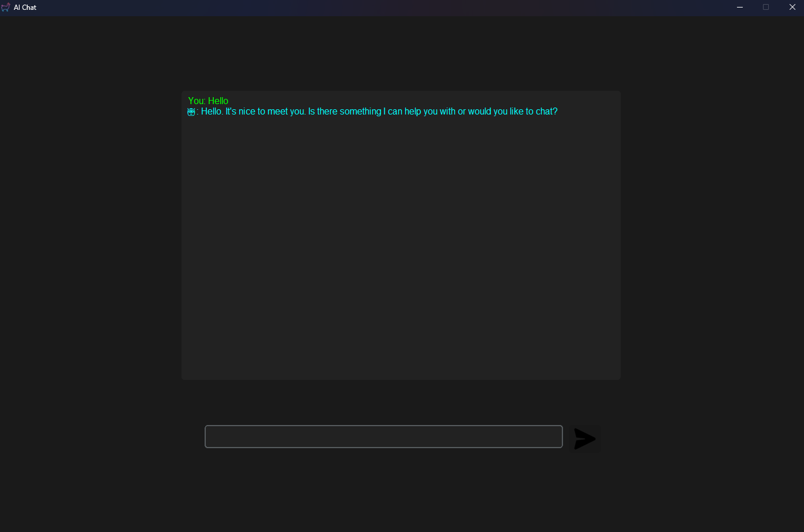

# Desktop‑AI‑Chatbot

A sleek, dark‑themed desktop chatbot built with 🐍 Python, CustomTkinter GUI, and the Groq LLaMA 3.1 API.

## ✨ Features
- Context‑aware conversation memory
- Streaming AI response with typing effect
- Responsive UI with multithreading
- Secure Groq API key via `.env`
- PyInstaller compatible for standalone builds

## 📂 Project Structure
```
├── assets/           # UI icons and screenshots  
├── app.py            # Main application  
├── requirements.txt  # Dependencies  
├── .gitignore        
├── LICENSE           
└── README.md         
```

## ⚙️ Tech Stack
- **Python** – core logic  
- **CustomTkinter** – modern GUI components  
- **Groq API** – LLaMA 3.1 model responses  
- **Pillow** – image handling  
- **dotenv** – secure environment variables  
- **threading / os / sys** – backend utilities  

## 🧩 Installation

1. Clone the repo:
   ```bash
   git clone https://github.com/KaisoX24/Desktop-Ai-chatbot.git
   cd Desktop-Ai-chatbot
   ```

2. Create & activate a virtual environment:
   ```bash
   python -m venv venv
   # Windows:
   venv\Scripts\activate
   # macOS/Linux:
   source venv/bin/activate
   ```

3. Install dependencies:
   ```bash
   pip install -r requirements.txt
   ```

4. Add your Groq API key in a `.env` file:
   ```
   GROQ_API_KEY=your_api_key_here
   ```

5. Run the app:
   ```bash
   python app.py
   ```

6. (Optional) Build a standalone executable:
   ```bash
   pyinstaller --onefile --windowed app.py
   ```

## 🖼️ Screenshots



## Author
**Pramit Acharjya** – [GitHub](https://github.com/KaisoX24)

## License
This project is licensed under the MIT License.
